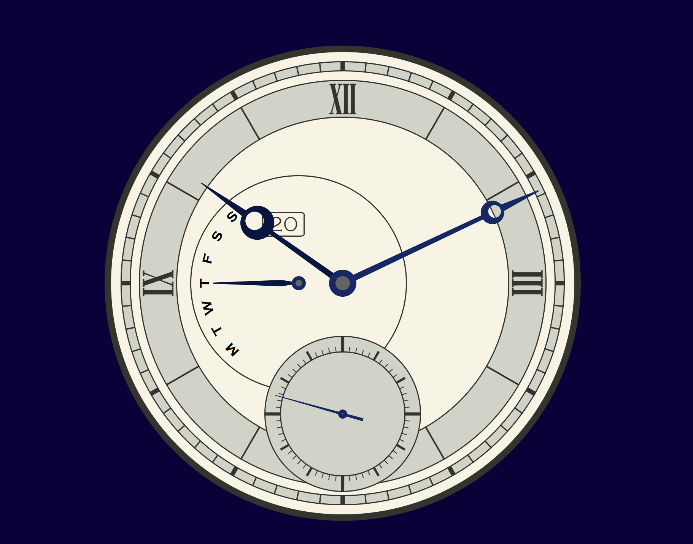

# 日本語
## Single-file, standalone clock

ブラウザ上で動作する，アナログ・デジタル時計です．

<p align="center">
  
</p>

HTML，CSS，JavaScriptを1つのHTMLファイルにまとめており，
特別なビルド環境やサーバーを必要とせず，ブラウザから直接実行できます．

スマートフォンやPCなど，ブラウザが動作する環境での利用を想定しています．

## Features

- アナログ時計
- デジタル時計
- 秒針
- 日付表示
- 曜日表示
- 秒表示用のサブダイヤル
- 5分単位を基準としたアラーム
- アラーム設定時の円形インジケータ
- レスポンシブな時計表示
- HTMLファイル単体での動作

## Usage

```index.html``` をブラウザで開いてください．

サーバーやビルドシステムは必要ありません．

スマートフォンにHTMLファイルを保存して，ブラウザから開いて使用することもできます．

## Alarm

メニューからアラームを設定できます．

アラームは現在時刻を基準として，次の5分区切りを基準に設定されます．

設定すると，アナログ時計上に円形のインジケータが表示され，
アラーム時刻までの時間を視覚的に確認できます．

### Alarm sound

アラーム音の実装方法は固定されていません．

用途に応じて，以下の方法を利用できます．

- ローカルの音声ファイルを使用する
- 外部URLの音声ファイルを使用する
- JavaScriptで音声を生成する

例えば，ローカルファイルを使用する場合は，

```JS
const audio = new Audio('./sound/alarm.mp3');
```

のように指定できます．

外部URLを使用する場合は，

```JS
const audio = new Audio('https://example.com/alarm.mp3');
```

のように指定できます．

また，Web Audio APIなどを利用して，JavaScriptから直接音声を生成することもできます．

## Structure

基本的な構成は以下の通りです．

```bash
├── index.html
├── README.md
└── sound/
    └── alarm.mp3    # 必要な場合のみ
```

アラーム音をJavaScriptで生成する場合や，外部URLを利用する場合は，
```alarm.mp3``` は必要ありません．

また，完全に1ファイルで構成する場合は，

```bash
└── index.html
```

だけでも動作します．

## Technical Details

時計の時刻はJavaScriptの ```Date``` オブジェクトから取得しています．

アナログ時計の針はJavaScriptから回転角を計算し，
CSSの ```transform: rotate()``` を使用して表示しています．

時針・分針・秒針に加えて，曜日を示す針も実装しています．

秒針はより滑らかに動作するよう，一定間隔で更新しています．

時計の目盛りはJavaScriptによって動的に生成しています．

## Browser

モダンブラウザでの利用を想定しています．

- Google Chrome
- Microsoft Edge
- Mozilla Firefox
- Safari

スマートフォンのブラウザでも利用できます．

## Offline Use

時計本体はブラウザ上のJavaScript，HTML，CSSのみで動作します．

ただし，アラーム音については実装方法によって外部依存が発生する場合があります．

完全なオフライン動作を必要とする場合は，
音声ファイルをローカルに保存するか，JavaScriptで音声を生成してください．

## License

MIT License

Copyright (c) 2026

---
---
# ENGlish
## Single-file, standalone clock

A browser-based analog and digital clock implemented in a single HTML file.

<p align="center">
  
</p>

HTML, CSS, and JavaScript are contained in one file, so no build system or server is required.

It is designed to run directly in a modern web browser on both desktop and mobile devices.

## Features

- Analog clock
- Digital clock
- Second hand
- Date display
- Day-of-week indicator
- Small seconds subdial
- Alarm based on 5-minute intervals
- Circular alarm indicator
- Responsive clock display
- Single-file implementation

## Usage

Open ```index.html``` in a web browser.

No server or build system is required.

The HTML file can also be saved on a smartphone and opened directly in a browser.

## Alarm

An alarm can be configured from the menu.

The alarm is calculated based on the next 5-minute interval relative to the current time.

When an alarm is set, a circular indicator is displayed on the clock face to provide a visual indication of the alarm timing.

### Alarm sound

The alarm sound implementation is intentionally not fixed to a specific method.

Depending on the use case, the alarm sound can be implemented using:

- A local audio file
- An external audio URL
- Audio generated directly in JavaScript

For example, a local audio file can be loaded with:

```JS
const audio = new Audio('./sound/alarm.mp3');
```

An external audio file can be loaded with:

```JS
const audio = new Audio('https://example.com/alarm.mp3');
```

Alternatively, audio can be generated directly in JavaScript using APIs such as the Web Audio API.

## Structure

A possible project structure is:

```bash
├── index.html
├── README.md
└── sound/
    └── alarm.mp3    # optional
```

The ```alarm.mp3``` file is not required when using an external URL or generating the alarm sound in JavaScript.

The project can also be kept completely self-contained:

```bash
└── index.html
```

## Technical Details

The current time is obtained using the JavaScript ```Date``` object.

The analog clock hands are calculated in JavaScript and rendered using CSS transformations with ```transform: rotate()```.

In addition to the hour, minute, and second hands, the clock includes a hand indicating the day of the week.

The second hand is updated at a higher frequency to provide smoother movement.

Clock face markers are generated dynamically using JavaScript.

## Browser

The clock is intended for use with modern web browsers, including:

- Google Chrome
- Microsoft Edge
- Mozilla Firefox
- Safari

It can also be used in mobile browsers.

## Offline Use

The clock itself runs entirely in the browser using HTML, CSS, and JavaScript.

However, the alarm sound may introduce an external dependency depending on how it is implemented.

For fully offline use, use a local audio file or generate the alarm sound directly in JavaScript.

## License

MIT License

Copyright (c) 2026